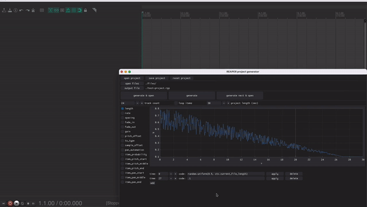

# grrpg
granular synthesis implemented as a project file generator for REAPER DAW



this is a prototype / proof-of-concept 

---

### requirements
python 3.8+

dearpygui
reathon
soundfile
pyinstaller

### setup
* macOS:
	1. run mac_scripts/setup.command 
	2. run mac_scripts/run.command to launch app
* generic:
	```
	pip3 install -r requirements.txt
	python3 grrpg_app.py
	```

### basic operation
* choose audio file folder & output project name
* select one of the automatable parameters
* use \[add\] button to insert new time frame with python expression
* use \[generate\] to make a REAPER project file
* macOS: use \[generate next and open\] to make a file with a new name and open it in REAPER

### known issues
* may have problems with pyinstaller & soundfile library

GPL3